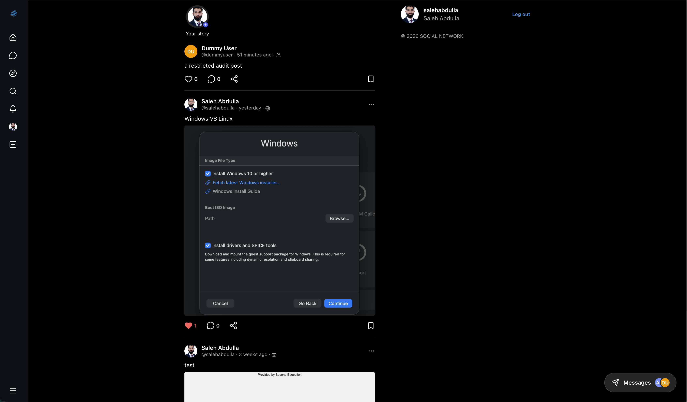
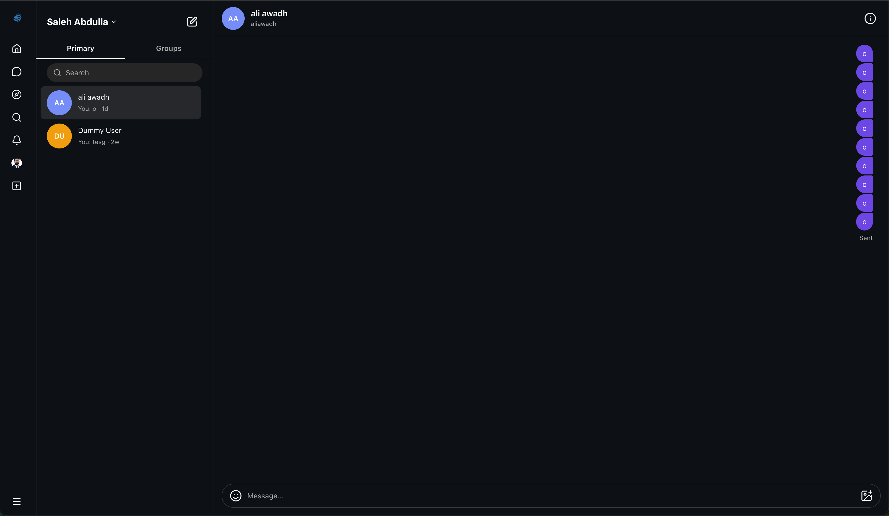
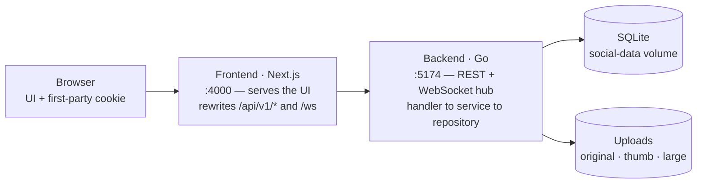

<div align="center">

# Social Network

### A Facebook-style social network, built full-stack and realtime

Profiles, follow requests, posts with three privacy levels, comments, groups with events
and a shared chat, notifications, and realtime private messaging. One Go service owns the
data and the WebSocket hub; a Next.js app serves the UI and proxies everything to that
service, so the browser only ever talks to one origin and the session cookie stays
first-party.

[](https://github.com/SalehAbdulla/social-network/actions/workflows/ci.yml)


</div>

---

## Overview

A complete, self-hosted social network — accounts and profiles, follow requests, posts with
three privacy levels, comments and reactions, groups with events and a shared chat,
notifications, and realtime private messaging — backed by a versioned SQLite schema and a
single WebSocket hub.

This file explains what was built, how it is laid out, and how to run it. The deeper
environment and release details live in the [documentation map](#documentation-map).

## Table of contents

- [Screenshots](#screenshots)
- [Highlights](#highlights)
- [Architecture](#architecture)
- [Features](#features)
- [Tech stack](#tech-stack)
- [Project layout](#project-layout)
- [Getting started](#getting-started)
- [Quality and testing](#quality-and-testing)
- [Design rules worth knowing](#design-rules-worth-knowing)
- [Documentation map](#documentation-map)

## Screenshots

<p align="center">
  
  
</p>

<p align="center"><sub>Left: the home feed. Right: realtime private messaging.</sub></p>

## Highlights

- **One origin, first-party sessions.** The Next.js app rewrites `/api/v1/*` and `/ws` to the
  Go service, so the HttpOnly session cookie is never third-party and there is no CORS surface.
- **Privacy that cannot drift.** Every read path — feed, single post, profile, likes, media and
  comments — shares one SQL visibility fragment, so no surface can disagree about who may read a post.
- **Realtime by default.** Typing indicators, read receipts, presence, and notification pushes all
  ride one `gorilla/websocket` hub, with separate notification and message badges.
- **An upload pipeline, not just a file input.** The type is sniffed from the bytes, every resizable
  image is stored at three sizes, and a collector reclaims files when their post, comment, story or
  message is gone.
- **Cross-language drift guards.** A Go test reads the TypeScript media-limit module and compares the
  numbers, so the browser and the server can only move together.
- **A real test suite.** Go unit and integration tests, a query-plan check, an end-to-end API tour,
  and a headless-Chrome browser suite over an isolated database.
- **Reproducible, unprivileged containers.** Two images with pinned base-image digests, non-root
  users, readiness probes, and migrations applied at boot.

## Architecture



The browser only ever reaches the frontend's port; the frontend proxies API calls, uploaded
media and the WebSocket upgrade to the backend, and the backend is the only writer to SQLite
and the upload directory. Both containers run as unprivileged users, and only the frontend
publishes a port (bound to loopback, with a reverse proxy expected in front of it).

## Features

**Accounts and profiles** — register with the five mandatory fields plus an optional
nickname (generated when left blank), avatar, About Me and a public/private choice;
bcrypt password hashing; HttpOnly cookie sessions that survive a restart, with a password
change that rotates the session and signs out the account's other browsers. Profiles put the
avatar beside the counts — posts, followers and following — with the name and bio under them,
and the media tab is a three-column grid of squares. The post count is viewer-relative, the
same as the two follower counts: it is the posts the person looking may read, so the number
and the list under it cannot disagree. Following a private profile is a request the owner
accepts or declines; following a
public profile happens immediately. Discovery has two doors: the Discover page, and the
"People you may know" rail the feed shows, which offers a few members you do not follow
yet and a button to change that.

**Posts, comments and reactions** — three privacy levels (`public`, `followers` for
"almost private", `selected` for "only the followers you pick"), up to four images or
GIFs per post, comments with their own image, and reaction scores. On a wide screen the
feed opens a post in an Instagram-style overlay — the media on the left, and on the right
the header, caption, the post's actions and the comments with the composer pinned at the
bottom — while the post's own page keeps its inline list and a phone keeps the bottom
drawer. Stories expire
after 24 hours, and the strip draws a gradient ring around an author's avatar until
you open their story — the "seen" state is kept per account on the server, so it
follows you to another device. An unsent post is kept in the browser, so a refresh does not lose the
text or the audience chosen for it; the composer says what a publish is still missing
instead of disabling its button, and Ctrl/Cmd + Enter publishes. Beside the form it
previews the draft exactly as the card will draw it, under a banner that names the
audience the draft has chosen — "Visible to everyone", or the followers it picks by
name, or, once the author's own profile is private, the reminder that even a public
post then reaches only those followers. Any post can also be bookmarked: the list
is private to the member and lives at `/saved`, and because it runs
the same three privacy levels as the feed, a saved post that later becomes unreadable
simply drops out of it. The feed does not replace what a reader is looking at when a post
arrives over the socket: a sticky "New posts" pill appears, and pressing it is what folds
the newest page in. It is never offered to the author, whose own publish has already
loaded the page they are on. The post's author also sees its insights — how many accounts
its audience rule actually admits, its reactions and comments, and how those reactions
fall across the days they arrived — and no one else is offered them.

**Groups** — create, browse, join by request or invitation, post, comment, share
media, schedule events with Going / Not going replies, chat together, transfer
ownership, and leave or delete. The events tab is ordered by when things happen
rather than when they were posted, so it splits into what is still to come and
what has been, and an hour before an event starts the members who said they were
going are reminded once.

**Notifications and chat** — group invitations, join requests, group events, follow
requests and comments raise notifications; private messages raise a different event.
Both arrive live over `/ws` and both are counted separately in the sidebar. Chat has
typing indicators, read receipts, presence, edits, scoped deletion, and a reaction on
any message that both sides of the conversation can see. A conversation has a Media tab
listing the photos and videos shared in it, and those — like a group post's photo — open
in the app's viewer rather than a new tab.

**Media** — JPEG, PNG, GIF, WebP, MP4 and WebM uploads with the type sniffed from the
bytes, images capped at 10 MB and video at 50 MB, and a collector that reclaims
uploads once the post, comment, story or message pointing at them is gone. Every image
that can be resized is stored three times: the original, a 480 px thumbnail and a 1600 px
large version, which the same URL serves when asked with `?size=thumb` or `?size=large`.
That is why a feed card downloads 46 KB where it used to download a 777 KB phone photo,
and why an upload with no such file — a GIF that has to keep its animation, a video, a
picture already narrower than a cap — answers those requests with the original instead.
Clicking a photo on a post or a comment opens it in a full-screen viewer rather than a
new tab, with the arrow keys, the on-screen arrows and a swipe moving through the set.

A photo wider than the 1600 px cap is shrunk in the browser before it is sent, so what
travels and what is kept is the capped file rather than a 12-megapixel original. A GIF is
left alone there — a still frame of an animation is a different picture, not a smaller one.

**Search** — one page looks through people, groups and posts at once. The post half runs
the same privacy rule as the feed, so a search only ever returns posts you could have
opened, and the terms you tried are kept in your browser and offered back. `#hashtags`
and `@mentions` are links wherever text is shown — posts, comments, group posts and chat:
a tag opens a page of the posts carrying it, matched as a whole word and behind the same
privacy rule, and a mention opens the member it names.

## Tech stack

| Layer | Choice |
| --- | --- |
| Backend | Go 1.25, `net/http` with the pattern-based `ServeMux`, layering of handler → service → repository |
| Database | SQLite (`mattn/go-sqlite3`) with embedded, versioned SQL migrations (`golang-migrate`) applied at boot |
| Realtime | `gorilla/websocket` hub for chat, typing, presence and notification pushes |
| Auth | `golang.org/x/crypto/bcrypt` plus database-backed cookie sessions |
| Frontend | Next.js 16 (App Router), React 19, TypeScript, Tailwind CSS v4 |
| Client data | `axios` against a typed wrapper, `react-hot-toast` for errors, `lucide-react` icons |
| Packaging | Docker Compose: one image per service, one named volume for the database and uploads |

## Project layout

```
backend/
  cmd/                     main, router, security middleware, integration tests, seed
  pkg/app/handlers/        HTTP and WebSocket handlers (validation, responses)
  pkg/app/service/         business rules (privacy, permissions, notifications, sessions)
  pkg/app/repositories/    SQL; the post-visibility fragment lives in PostRepository.go
  pkg/db/migrations/sqlite versioned up/down migrations, applied automatically at boot
  pkg/websocket/           hub, clients, frame types, and the protocol document in the README
  pkg/config, pkg/logger, pkg/middleware, pkg/models, pkg/payload
frontend/
  src/app/                 routes (feed, post, profile, messages, groups, notifications, login)
  src/app/components/      UI building blocks, including the dialogs and their focus contract
  src/app/api/             axios client and the typed request helpers
  src/app/lib/             shared hooks: paging, live refresh, dialog focus, the upload limits
  src/proxy.ts             page-level session gate (the API and /ws are excluded)
  scripts/                 browser smoke suite driven over the Chrome DevTools Protocol
scripts/                   the API tour, the base-image pin check, the WSL launcher
make help                  the commands in one place: dev, check, smoke, seed, api-tour, pin-check
compose.yaml               both services and the social-data volume
deploy/Caddyfile.example   a sample reverse proxy, reviewed rather than run here
DEPLOYMENT.md              environment variables, headers, limits, backup, release checklist and checks
TODO.md                    the open work list and the reasoning behind what is closed
.github/workflows/ci.yml   the checks below as a GitHub Actions workflow
.gitlab-ci.yml             the same four checks for the school's GitLab, which is this repo's origin
```

## Getting started

### Docker (a full stack)

```sh
cp .env.example .env      # APP_ENV + FRONTEND_ORIGIN; see DEPLOYMENT.md for the rest
docker compose up --build -d
open http://localhost:4000
```

Two images are built (`social-network-backend`, `social-network-frontend`), both run as
unprivileged users, and only the frontend publishes a port — bound to loopback, with the
reverse proxy expected to sit in front of it. SQLite and uploads live in the `social-data`
volume, and migrations run at backend startup. Stop with `docker compose down`; do not add
`-v` unless you mean to delete all application data.

### Local development

```sh
./run.sh                  # starts backend (5174) and frontend (4000), Ctrl+C stops both
```

`run.sh` delegates to `scripts/run-wsl.sh` under WSL. To run the halves by hand:

```sh
cd backend  && sh ./dev.sh          # Windows: .\dev.cmd
cd frontend && npm ci && npm run dev
```

The frontend needs `BACKEND_URL` in `frontend/.env.local` (copy `.env.example`); Next.js
rewrites `/api/v1/*` and `/ws` to that origin, so the browser keeps using port 4000 only.
Register an account on the login page — nothing is seeded, and there is no development
login shortcut.

The backend also answers `GET /api/v1/health` (liveness) and `GET /api/v1/ready` (readiness,
database-backed) without a session; both containers use the second one as their `HEALTHCHECK`.
They are documented in `DEPLOYMENT.md`.

## Quality and testing

```sh
make check          # backend build/vet/test and frontend lint/types/build
make smoke          # the browser suite, with CHROME_PATH set if Chrome is not in the usual place
make api-tour       # every route in the API, against a running backend
make pin-check      # whether the base-image pins still match their tags
make help           # the rest
```

`make` wraps the commands below rather than replacing them; each target is one line calling
something that already existed. They are the same commands CI runs, written down in one place so
the release list and the pipeline cannot drift: 

```sh
cd backend  && go build ./... && go vet ./... && go test ./...
cd frontend && npm ci && npm run lint && npx tsc --noEmit && npm run build
cd frontend && npm run test:integration
node scripts/pin-base-images.mjs
```

`make api-tour` is the one that needs a server: it calls every route in `backend/cmd/router.go`
with the status each should answer, from registration to the group it deletes again, and
`backend/cmd/api_tour_test.go` fails if the tour and the router ever disagree about what routes
exist. It is the way to exercise the API without the UI, and it documents two things a client
author would otherwise learn from a 400: registration and login read form values while the rest of
the API reads JSON, and a socket upgrade needs an allowed `Origin` or it is refused with 403.

The last command in that block builds temporary backend and frontend servers, seeds an isolated
database under `backend/tmp`, and drives headless Chrome through the real UI; it needs Chrome
installed (`CHROME_PATH` overrides the location; the fallbacks are the usual install
paths per platform, and a Linux runner normally sets it). `docker compose config` and
`docker compose build` are the container checks, and `npm audit` / `govulncheck ./...` cover
dependency advisories. `node scripts/pin-base-images.mjs` asks a different question — whether the
base-image digests the Dockerfiles and `.gitlab-ci.yml` pin are still what their tags point at, and
which toolchain they carry — and it reports drift without blocking. Everything except the browser
suite runs in CI on every push; the browser suite has an opt-in job in both files instead — see
`.gitlab-ci.yml` (this repository's origin is the school's GitLab) and `.github/workflows/ci.yml`.
`DEPLOYMENT.md` puts them in release order. The Go suite carries the load smoke — fifty
concurrent sockets whose broadcast is asserted, sustained throughput, and the rate limiter's
boundary — and the browser suite opens fifty sockets through the frontend proxy, which is the only
place the proxy's upgrade path is exercised at concurrency.

## Design rules worth knowing

- **Post visibility** is one SQL fragment shared by every read path — the feed, a single
  post, profile posts, the likes tab, profile media, comments and direct media access — so
  the six surfaces cannot drift apart. `followers` is a live relation (unfollowing revokes
  access), while `selected` is a grant recorded when the post was written: it survives an
  unfollow and only an edit re-validates it.
- **Media access** mirrors the post or comment it hangs off. Avatars, group images and
  story media are readable by any signed-in member, and a cover photo needs a public
  profile or a follow. Stories carry no audience, which is recorded as a decision in
  `TODO.md`.
- **Sessions** live in the `session` table (14 days idle, 30 days absolute), so a backend
  restart does not sign anyone out. Logging in revokes the previous token, and so does
  changing the password (`PUT /api/v1/users/me/password`), which returns the replacement
  cookie to the browser that made the change.
- **Password reset** is the one unauthenticated flow that answers identically for an unknown
  address: `POST /api/v1/auth/password-reset` always answers `202` with the same sentence, and the
  confirm endpoint takes the token, stores the new password and revokes every session the account
  had. Tokens are single-use, stored as a sha256, and expire after 30 minutes. It answers `503` when
  the deployment has no mail provider — `DEPLOYMENT.md` says how to configure one, and why
  development logs the link instead.
- **Uploads** are typed by their bytes, not their filename, and are answered `400` for an
  unreadable or empty file and `413` past a size ceiling, which names the file's own measured
  size — "Image is 12.4 MB; the limit is 10 MB." An image's declared canvas is capped at
  40 megapixels from its own header, WebP included, and the same allow-list is applied when a file
  is served: a row whose type is not one of the six is downloaded rather than rendered inline. The
  ceilings live in one place per language — `frontend/src/app/lib/mediaLimits.ts` and the constants
  in `MediaHandler.go`/`CommentHandler.go` — and `backend/pkg/app/handlers/media_limits_test.go`
  reads the TypeScript module and compares them, so the browser and the server can only move
  together. It checks the numbers, not the wording, and not this document; the limit tables here and
  in `DEPLOYMENT.md` are still kept in step by review.
- **Derivatives** are the other half of an upload. An image that can be resized is stored three
  times — the original, a 480 px `_thumb` and a 1600 px `_large` — and one URL answers all three:
  `GET /api/v1/media/{id}?size=thumb|large|original`, where a missing derivative (an old row, a
  GIF, a video, a picture already narrower than the cap) is answered with the original. That
  fallback is what lets the frontend name both candidates in `srcset` without knowing anything
  about the file, and it is why an unknown `?size=` value is a `400` rather than another quiet
  full-size answer. The two caps are named in `frontend/src/app/lib/mediaLimits.ts` and enforced in
  `backend/pkg/media`, with the same drift check holding them together.
- **Dates** go through `dateLabel` (absolute, in the visitor's locale) or `relativeLabel`
  ("3 hours ago", falling back to the absolute beyond a week, both via `Intl`). Either way the
  element is a `<time dateTime={isoTimestamp(...)} title={dateLabel(...)}>`, so the exact instant
  survives the wording. Join dates, event start times and chat timestamps stay absolute on purpose:
  there the fact matters more than the recency.

## Documentation map

| File | What it covers |
| --- | --- |
| `DEPLOYMENT.md` | Environment variables, security headers, request and upload limits, backup/rollback, release checks |
| `backend/README.md` | Backend environment, the chat permission rule, how to test |
| `frontend/README.md` | Local setup, the same-origin proxy contract, the browser checks |
| `TODO.md` | Every open item with its priority, and the reasoning recorded with each closed one |
| `SocialNetworkERD.drawio` | Entity-relationship diagram of the schema |

---

<sub><strong>Social Network</strong> — full-stack, realtime, self-hosted · [github.com/SalehAbdulla/social-network](https://github.com/SalehAbdulla/social-network)</sub>
